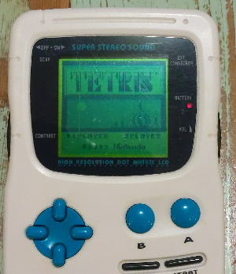
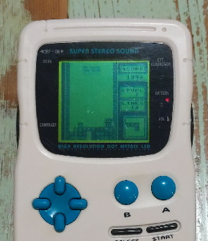

# Tetris for the Mega Duck
This Romhack brings classic Game Boy Tetris to the Mega Duck console (a clone with various changes to make it incompatible with the GB). 

It's a modified version of the [dissasembly by vinheim3](https://github.com/vinheim3/tetris-gb-disasm).

Most of the work for this port was in adapting the Tetris music and sfx driver to accommodate the shuffled APU register addresses and bit values. Changes for constants can be found in the `hardware.inc`.

### Download
Available in the [Releases section](https://github.com/bbbbbr/megaduck-tetris-patch/releases) of this repo, or at [RHDN](https://www.romhacking.net/hacks/7771/).

### Playing on console hardware:
As with unmodified Tetris this is meant to run on a bare 32K cart with no save RAM and no MBC. For now [Inside Gadgets](https://shop.insidegadgets.com/product/megaduck-32kb-flash-cart) and [A2 Heaven](http://www.a2heaven.com/webshop/index.php?rt=product/product&product_id=172) are probably the only compatible flash cartridges. If needed there are [3D printable cart shells](https://github.com/bbbbbr/megaduck_cartridge_shell).

### Playing on console emulators:
If the patched ROM is played in an emulator then most likely the music and sfx will sound incorrect to some degree. At this time all Mega Duck emulators I'm aware of do not handle NR32 correctly, some may lack other required changes.

### Building
* Install RGBDS v0.6.1
* set the environment var `RGBDS_PATH` (ex: `export RGBDS_PATH= ~/rgbds/0.6.1/`)
* optionally set: `UPS_PATCHTOOL_PATH` (ex: `export UPS_PATCHTOOL_PATH= ~/ups_patch_tool/linux_ups_x64/ups`)
  * tool: https://github.com/rameshvarun/ups
* Run `make megaduck; make createpatchduck` within the `disasm` directory
* The result will be
  * `tetris.duck` in the `disasm/build_duck` directory
  * `tetris_megaduck_patch.ups` in the `patch` directory

--------------------------------

# Original Readme from: [dissasembly by vinheim3](https://github.com/vinheim3/tetris-gb-disasm).

--------------------------------

# Common
* Place `tetris.gb` in the `tools/` directory, and `web/` directory
* Former is used for scripts, and `tools/cmp.sh`, and the latter for web visualisations

# Building
* Install RGBDS v0.6.1
* Run `make` within the `disasm` directory
* Run `tools/cmp.sh` to compare built ROM against original ROM

# Web
* Start a web server within the `web/` directory, eg `python3 -m http.server`
* Navigate to the root page to see a list of game screens and sprites

# Project Structure
* `disasm`
  * `code` - dissected and commented asm that runs the game
  * `data` - large blocks of data, layouts are in `.bin` files
  * `gfx` - pngs of 1bpp and 2bpp data
  * `include` - constants, hardware definitions, ram, macros and structs
  * `includes.s` - imported definitions, excluding those that need building, eg ram
* `tools` - misc tools to help with disassembly
* `web` - the html+js in 1 file to visualise
  * `docs` - reference images, and flow .drawio

# Note on improvements
The project serves to describe everything that makes the game function as it does. Some things are not completely clear from the outset. If you need a full guide on a particular concept, eg sound engine, or some part of the disassembly needs further clarification, please feel free to raise an issue
